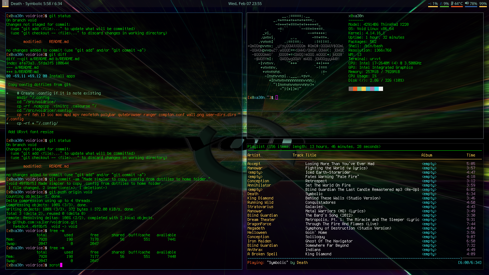

# Install Void Linux

## Credits;

* Luke Smith [voidrice](https://github.com/LukeSmithxyz/voidrice)
* Drew DeVault [dotfiles](https://drewdevault.com/feed.xml)
* David Paulos [XbpsUI](https://github.com/davidpaulos/XbpsUI)

## Install

**TODO: This text needs changes**

Update Void Linux

    sudo xbps-install -Syu

Install elementary software

    sudo xbps-install -S git neovim
    sudo xbps-install -S bash-completion neofetch
    sudo xbps-install -S tlp powertop htop lm_sensors fzf intel-ucode

Crete user's folders

    mkdir ~/Videos ~/Documents ~/Downloads ~/Pictures ~/Music ~/src

Create src folder and clone dotfiles

    cd ~/src
    git clone https://github.com/xajler/voidlinux-i3.git

Create /mnt/usb dir and mount to it

    sudo mkdir /mnt/usb
    sudo mount /dev/sdb1 /mnt/usb

Copy .ssh and chmod-it

    cp -rf /mnt/usb/.ssh/ ~/
    cd ~/.ssh/
    rm known_hosts
    chmod 600 id_rsa
    chmod 644 id_rsa.pub

Copy dotfiles to home folder

    cp -rf ~/src/voidlinux-i3/* ~/
    cp -rf ~/src/voidlinux-i3/.* ~/

Install Vim Plugs (inside neovim)

    :PlugInstall

Install sound

    sudo xbps-install -S alsa-utils alsa-plugins alsa-lib alsa-firmware
    sudo xbps-install -S alsa-utils pulseaudio ConsoleKit2 pavucontrol

Install xorg

    sudo xbps-install -S xorg-server xorg-apps xorg-minimal xinit xterm xcape
    sudo xbps-install -S xf86-video-intel xf86-input-libinput

Install apps

    sudo xbps-install -S rxvt-unicode ranger qutebrowser calcurse mpd mpc mpv compton
    sudo xbps-install -S youtube-dl ffmpeg feh rofi arandr scrot mirage tmux urxvt-perls
    sudo xpbs-install -S lxappearance xautolock mupdf cmatrix openvpn terminus-font ncmpcpp
    sudo xbps-install -S font-unifont-bdf font-awesome
    sudo xbps-install -S i3-gaps i3status i3lock i3blocks
    sudo xbps-install -S acpi playerctl sysstat tree ImageMagick w3m w3m-img dunst sxiv
    sudo xbps-install -S polybar
    sudo xbps-install -S xcalib bind-utils gnumeric R
    sudo xbps-install -S unclutter newsboat xclip
    sudo xbps-install -S noto-fonts-ttf liberation-fonts-ttf
    sudo xbps-install -S envypn-font
    sudo xbps-install -S firefox
    sudo xbps-install -S wget curl urlview
    # For compiling in general
    sudo xbps-install -S base-devel
    # For compiling st
    sudo xbps-install -S fontconfig-devel libX11-devel libXft-devel
    # For compiling dmenu
    sudo xbps-install -S libXinerama-devel libXft-devel freetype-devel

    # Suggestions by tlp
    sudo xbps-install -S acpi_call-dkms smartmontools

Add URxvt font resize

    cd ~/src
    git clone https://github.com/simmel/urxvt-resize-font
    sudo cp ~/src/urxvt-resize-font/resize-font /usr/lib/urxvt/perl

## Configuration

### Services

Link and start services

    la /var/service
    sudo ln -s /etc/sv/dbus /var/service
    sudo ln -s /etc/sv/tlp /var/service
    sudo ln -s /etc/sv/cgmanager /var/service
    sudo ln -s /etc/sv/consolekit /var/service
    reboot # easier than up all

### Wifi

WiFi config (WPA)

    # enter root
    su
    cp /etc/wpa_supplicant/wpa_supplicant.conf /etc/wpa_supplicant/wpa_supplicant-wlp3s0.conf
    wpa_passphrase <SSID> <password> >> /etc/wpa_supplicant/wpa_supplicant-wlp3s0.conf

    # test confing
    wpa_supplicant -i wlp3s0 -c /etc/wpa_supplicant/wpa_supplicant-wlp3s0.conf

    # Remove current wifi device 'wlp3s0' setup
     sudo rm /run/wpa_supplicant/wlp3s0

    # exit root
    exit

    # set up wifi and test it
    sudo ip link set wlp3s0 up
    ip addr
    ping -c 3 ksphoto.me

Multiple WiFi networks (WPA)

    # TODO

WiFi WEP notes

    # enter root
    su
    cp /etc/wpa_supplicant/wpa_supplicant.conf /etc/wpa_supplicant/wpa_supplicant-<SSID-name>.conf
    sudo vim /etc/wpa_supplicant/wpa_supplicant-<SSID-name>.conf
    # Add this text and change SSID and Wep key:
    network={
        ssid="MYSSID"
        key_mgmt=NONE
        wep_key0="YOUR AP WEP KEY"
        wep_tx_keyidx=0
        auth_alg=SHARED
    }

Temporary WiFi config (WPA)

    sudo sv stop wpa_supplicant
    # enter root
    su
    cp /etc/wpa_supplicant/wpa_supplicant.conf /etc/wpa_supplicant/wpa_supplicant-<SSID-name>.conf
    wpa_passphrase <SSID> <password> >> /etc/wpa_supplicant/wpa_supplicant-<SSID-name>.conf

    # Run and connect
    wpa_supplicant -i wlp3s0 -c /etc/wpa_supplicant/wpa_supplicant-<SSID-name>.conf &

### VPN

ProtonVPN

    # Create dir for openvpn cilent
    sudo mkdir -p /etc/openvpn/client

    # Create login conf with ProtonVPN username pass
    # First line in file: proton account user
    # Second line in file: proton account pass
    sudo vim /etc/openvpn/client/login.conf

    # Make this file only readable by root
    sudo chmod 600 /etc/openvpn/client/login.conf

    # Copy all ProtonVPN .ovpn to openvpn client
    sudo cp ~/Downloads/*.ovpn /etc/openvpn/client

Patch ProtonVPN ovpn's

    # Open ProtonVPN ovpn
    sudo vim /etc/openvpn/client/de-03.protonvpn.com.udp1194.ovpn

    # add login.conf to auth-user-pass
    auth-user-pass /etc/openvpn/client/login.conf

    # Comment two lines calling update-resolv-conf, create runit services
    #up /etc/openvpn/update-resolv-conf
    #down /etc/openvpn/update-resolv-conf

Create ProtonVPN runit services

    # TODO

### Bluetooth

Bluetooh

    sudo xbps-install -S bluez
    # Turn off bluetooth, use 'on' to turn it  on
    sudo bluetooth off
    # use rc.local to turn it off on startup

### Audio
Test sound with speakers and headphones

    # make sure nothing is at 0 or use pavucontrol
    alsamixer

    # unmute muted devices
    pavucontrol

Sound problems mulitpile card

    # Create alsa-base.conf if not existed
    sudo vim  /etc/modprobe.d/alsa-base.conf

    # Add this content int o alsa-base.conf (swaps sound cards, so 1 is defaust)
    options snd_hda_intel index=1,0

### Misc

Test urxvt font

    urxvt -fn 'xft:terminus:pixelsize=13'

Test calibration file
    # Get display name
    echo $DISPLAY

    # Test running Lenovo ThinkPad x220
    xcalib -d :0 .config/icc/Profiles/Color-LCD-#1-2016-02-16-02-0-2.2-F-S-XYZLUT+MTX.icc

Nodejs - npm

    Read in [npm docs](https://docs.npmjs.com/getting-started/fixing-npm-permissions)

    mkdir e~/.npm-global
    npm config set prefix '~/.npm-global'
    # Add to .bash_profile
    export PATH=~/.npm-global/bin:$PATH
    source ~/.bash_profile
